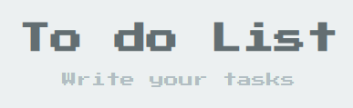

<h1 align="center">📔 To do List</h1>

<p align="center">

</p>

#

## 💻 Projeto:
<p align="center">

</p>

Criar uma To-do list usando React. Projeto usado para treinar funcionalidades básicas do ReactJs.

<p align="center">

</p>

#

### 🎯  Funcionalidades:

- [x] Adicionar
- [x] Deletar Elemento indiviudal 
- [ ] Editar Elemento indiviudal 
- [x] Deletar Todos os Elementos 

#

## 🚀 Tecnologias:
- HTML
- CSS
- Javascript
- ReactJs

#

## 👥 Clone o projeto:

```
git clone https://github.com/pablokaua/to-do-list-react.git
```